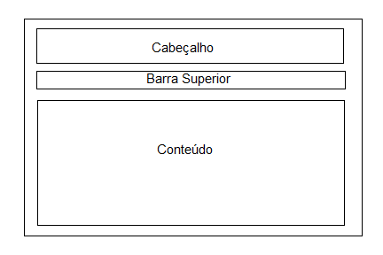
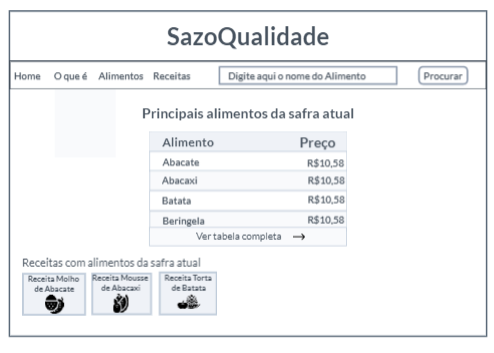
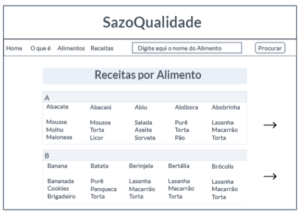
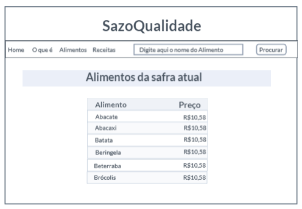
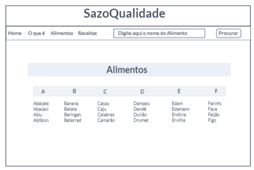
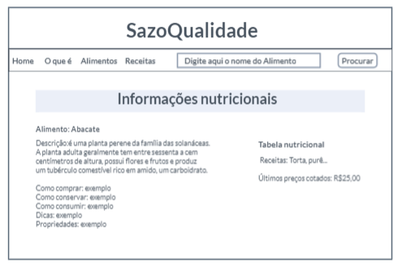
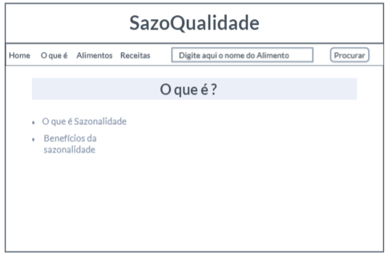
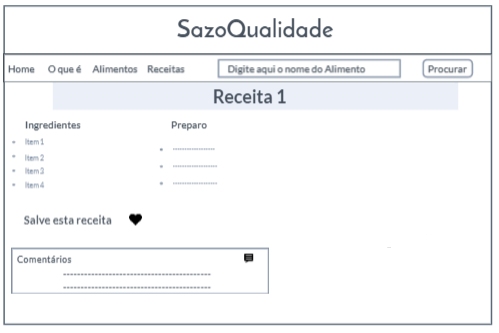
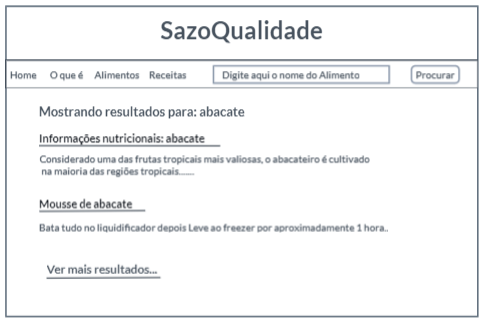

# Projeto de Interface

Dentre as preocupações para a montagem da interface do sistema, estamos estabelecendo
foco em questões como agilidade, acessibilidade e usabilidade. Desta forma, o projeto tem
uma identidade visual padronizada em todas as telas que são projetadas para funcionamento
em desktops e dispositivos móveis.

## Fluxo do Usuário

O diagrama apresentado na figura abaixo mostra o fluxo de interação do usuário pelas telas do
sistema. Cada uma das telas deste fluxo é detalhada na seção de Wireframes que se segue.
Para visualizar o wireframe interativo, acesse o ambiente MarvelApp do projeto: https://marvelapp.com/prototype/6607ee6

## Wireframes

Conforme fluxo de telas do projeto, apresentado no item anterior, as telas do sistema são apresentadas em detalhes nos itens que se seguem. As telas do sistema apresentam uma estrutura comum que é apresentada abaixo. Nesta estrutura, existem 3 grandes blocos, descritos a seguir. São eles:
Cabeçalho - local onde são dispostos elementos fixos de identidade (logo) .
Barra superior- Apresenta navegação do site (menu com elementos de navegação secundária da aplicação e barra de pesquisa).
Conteúdo - apresenta o conteúdo da tela em questão.

## Tela - Home-Page

A tela de home-page mostra os principais alimentos da safra atual a partir da API utilizada pelo sistema.
Com base na estrutura padrão a barra superior traz a barra de pesquisa e um menu lateral que quando acessado contem três elementos distintos:

Componente Home que leva o usuário ao menu principal.
Componente o que é? que leva o usuário à tela com uma breve explicação sobre alimentação levando em conta a sazonalidade e seus benefícios.
Componente alimentos que leva o usuário à lista de alimentos por ordem alfabética.
Componente receitas por alimentos que dá acesso à página da lista de receitas de acordo com o alimento escolhido.
Componente meus favoritos que leva o usuário para a tela de receitas preferidas.
O bloco de Conteúdo traz a tabela de principais alimentos da safra atual (título, lista ordenada e preço) com a opção ver mais, que leva à tabela completa, além do componente receitas com alimentos da safra atual (nome da receita e foto do prato) que leva à receita do alimento.

## Tela - Receita por Alimentos

A tela de receita por alimentos apresenta, no Bloco de Conteúdo, a lista de alimentos por ordem alfabética e suas respectivas receitas. O bloco de barra superior apresenta os mesmos elementos da Home-Page.

## Tela - Safra atual

A tela de Alimentos da safra atual, no Bloco de Conteúdo, contéma a lista de alimentos da safra atual bem como os seus respectivos preços. O bloco de barra superior apresenta os mesmos elementos da Home-Page.

## Tela- Alimentos

A tela Alimentos leva o usuário à lista de alimentos por ordem alfabética.O bloco de barra superior apresenta os mesmos elementos da Home-Page.

## Tela- Informações nutricionais

A tela Informações nutricionais apresenta informações com todos os detalhes da respectiva fruta/legumes e outras informações como manuseio e conservação.

## Tela-O que é

A tela O que é apresenta ao usuário uma breve explicação sobre alimentação levando em conta a sazonalidade e seus benefícios.

## Tela- Receita Selecionada

A tela Receita selecionada apresenta uma receita(ingredientes e modo de preparo) com um alimento específico.

## Tela - Resultado de Pesquisa

A tela Resultado de pesquisa traz a relação de informações associadas ao tópico informado. Este resultado é apresentado na Figura a seguir.

