# Programação de Funcionalidades

Pré-requisitos: <a href="2-Especificação do Projeto.md"> Especificação do Projeto</a>, <a href="3-Projeto de Interface.md"> Projeto de Interface</a>, <a href="4-Metodologia.md"> Metodologia</a>, <a href="3-Projeto de Interface.md"> Projeto de Interface</a>, <a href="5-Arquitetura da Solução.md"> Arquitetura da Solução</a>

Implementação do sistema descritas por meio dos requisitos funcionais e/ou não funcionais. Deve relacionar os requisitos atendidos os artefatos criados (código fonte) além das estruturas de dados utilizadas e as instruções para acesso e verificação da implementação que deve estar funcional no ambiente de hospedagem.

Para cada requisito funcional, pode ser entregue um artefato desse tipo

<h1>Página de Receitas</h1> 
Tela de Receitas por alimento: 

Requisitos Funcionais atendidos: 
RF-08: O site deve conter seção de receitas.  

Requisitos Não Funcionais atendidos: 
RNF-03: O site deve ter bom nível de contraste entre os elementos da tela em conformidade. 
RNF-07: O site deve proporcionar a facilidade de aprendizagem. 
RNF-08 O site deve proporcionar a facilidade de utilização.  

Artefatos da funcionalidade: 
style.css 
receita_sopa_abobrinha.html
receita_pao_banana.html 
receita_pimentao.html 
receita_salada_repolho.html  

Estrutura em HTML:

Estrutura em CSS:

Tela de Receita de Sopa de abobrinha:

Requisitos Funcionais atendidos: 
RF-08: O site deve conter seção de receitas.  

Requisitos Não Funcionais atendidos: 
RNF-03: O site deve ter bom nível de contraste entre os elementos da tela em conformidade. 
RNF-07: O site deve proporcionar a facilidade de aprendizagem. 
RNF-08 O site deve proporcionar a facilidade de utilização.  

Artefatos da funcionalidade: 
style.css 
receita_por_alimento.html  

Estrutura em HTML:

Estrutura em CSS:

Tela de Receita de Pão de Banana:

Requisitos Funcionais atendidos: 
RF-08: O site deve conter seção de receitas.  

Requisitos Não Funcionais atendidos: 
RNF-03: O site deve ter bom nível de contraste entre os elementos da tela em conformidade. 
RNF-07: O site deve proporcionar a facilidade de aprendizagem. 
RNF-08 O site deve proporcionar a facilidade de utilização.  

Artefatos da funcionalidade: 
style.css 
receita_por_alimento.html  

Estrutura em HTML:

Estrutura em CSS:

Tela de Receita de Pimentão recheado

Requisitos Funcionais atendidos: 
RF-08: O site deve conter seção de receitas.  

Requisitos Não Funcionais atendidos: 
RNF-03: O site deve ter bom nível de contraste entre os elementos da tela em conformidade. 
RNF-07: O site deve proporcionar a facilidade de aprendizagem. 
RNF-08 O site deve proporcionar a facilidade de utilização.  

Artefatos da Funcionalidade: 
style.css 
receita_por_alimento.html  

Estrurua em HTML:

Estrurua em CSS:

Tela de Receita de Salada de Repolho

Requisitos Funcionais atendidos: 
RF-08: O site deve conter seção de receitas.  

Requisitos Não Funcionais atendidos: 
RNF-03: O site deve ter bom nível de contraste entre os elementos da tela em conformidade. 
RNF-07: O site deve proporcionar a facilidade de aprendizagem. 
RNF-08 O site deve proporcionar a facilidade de utilização.  

Artefatos da Funcionalidade: 

style.css 
receita_por_alimento.html  

Estrutura em HTML:

Estrutura em CSS:

<h1>Alimenstos da safra atual</h1> 
Tela alimentos da safra atual: 

Requisitos Funcionais atendidos: 
RF-01: O site deve apresentar página com frutas/legumes da estação.  

Requisitos Não Funcionais atendidos: 
RNF-03: O site deve ter bom nível de contraste entre os elementos da tela em conformidade. 
RNF-07: O site deve proporcionar a facilidade de aprendizagem. 
RNF-08 O site deve proporcionar a facilidade de utilização.  

Artefatos da funcionalidade: 

Estrutura em HTML:

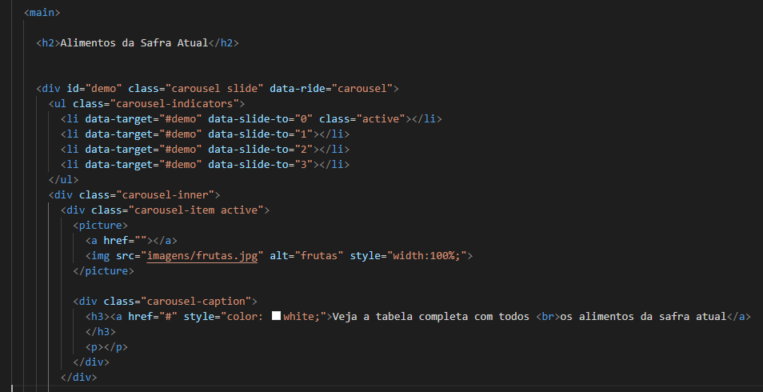
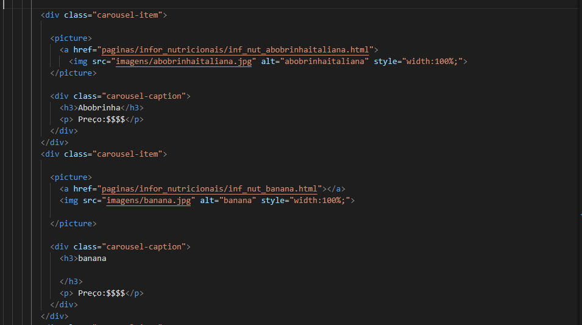
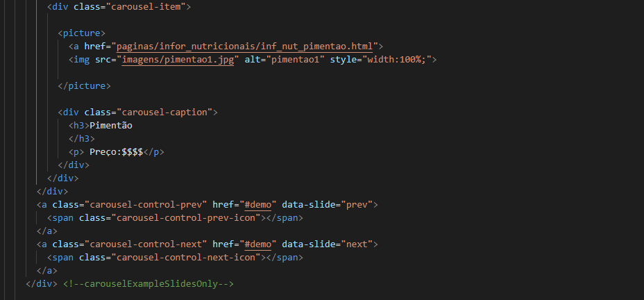

Estrutura em CSS:

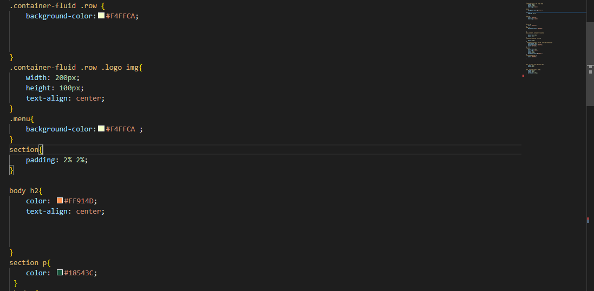
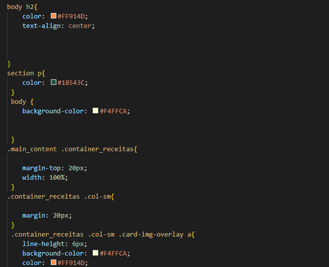
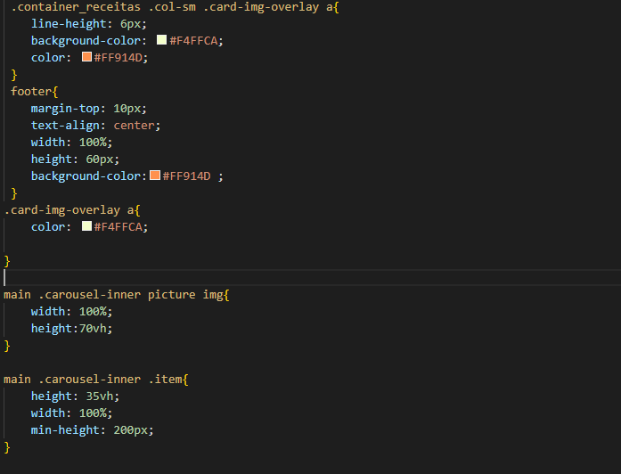

<h1>Pagina alimentos por ordem alfabética</h1> 
Tela da Pagina alimentos: 

Requisitos Funcionais atendidos: 
RF-01: O site deve apresentar página com frutas/legumes da estação.  

Requisitos Não Funcionais atendidos: 
RNF-03: O site deve ter bom nível de contraste entre os elementos da tela em conformidade. 
RNF-07: O site deve proporcionar a facilidade de aprendizagem. 
RNF-08 O site deve proporcionar a facilidade de utilização.  

Artefatos da funcionalidade: 

Estrutura em HTML:

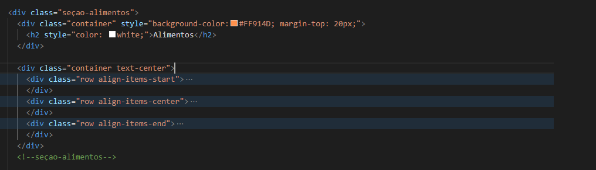

Estrutura em CSS:

  

<h1>Página de Informações Nutricionais</h1> 
Tela de Informações nutricionais: 

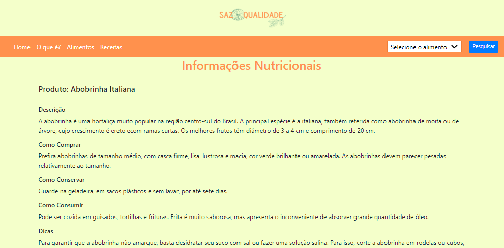

Requisitos Funcionais atendidos: 
RF-03: O site deve permitir ao usuário visualizar informações com todos os detalhes da respectiva fruta/legumes. 
RF04: O site deve oferecer uma funcionalidade de filtro/pesquisa para permitir ao usuário localizar uma fruta específica.

Requisitos Não Funcionais atendidos: 
RNF-03: O site deve ter bom nível de contraste entre os elementos da tela em conformidade. 
RNF-07: O site deve proporcionar a facilidade de aprendizagem. 
RNF-08 O site deve proporcionar a facilidade de utilização.  

Artefatos da funcionalidade 03: 
style.css 
inf_nut_abobrinhaitaliana.html
logo.png
  

Estrutura em HTML: 
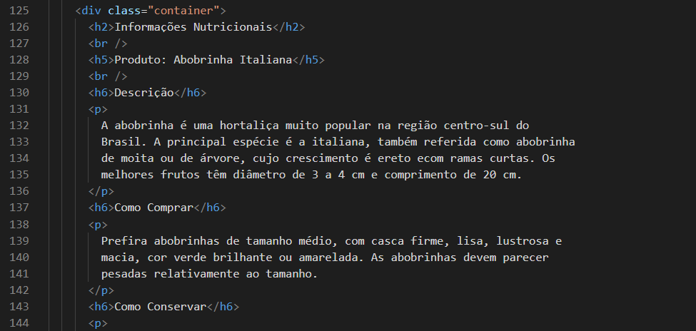

Estrutura em CSS: 
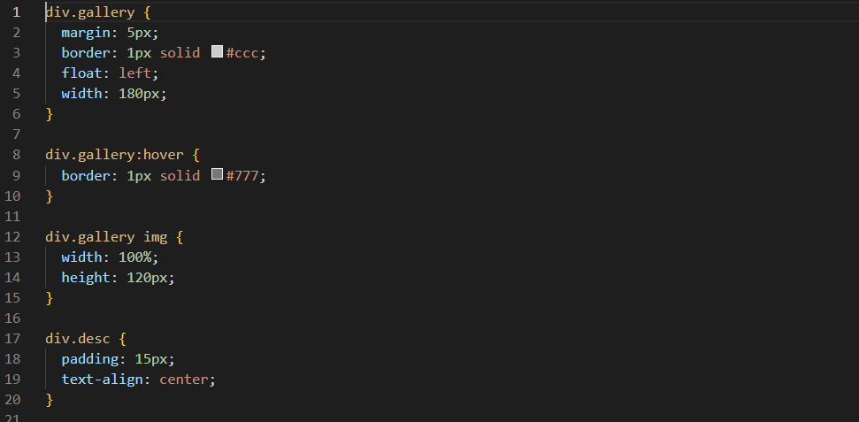
  

Artefatos da funcionalidade 04: 
style.css 
inf_nut_abobrinhaitaliana.html
logo.png
  

Estrutura em HTML: 
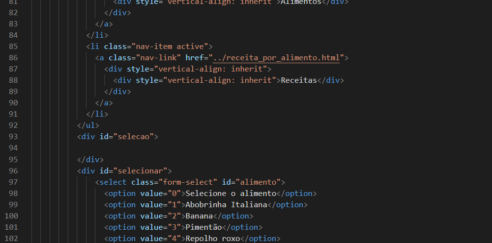

Estrutura em CSS: 
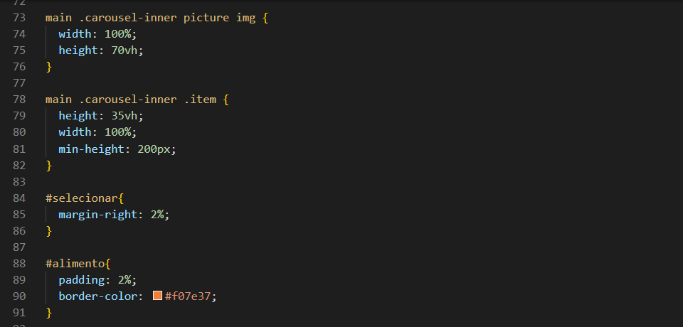
  
