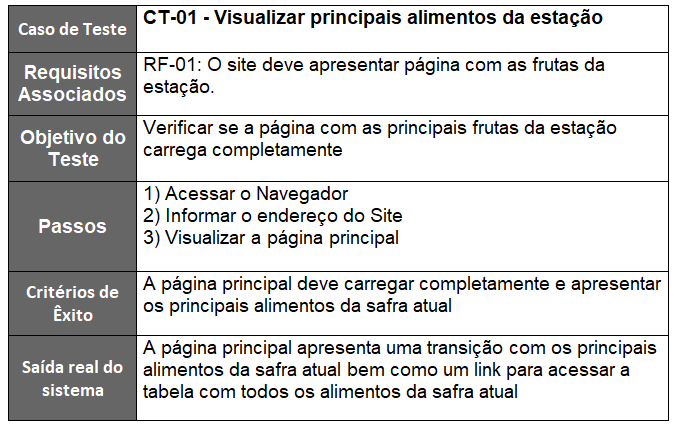
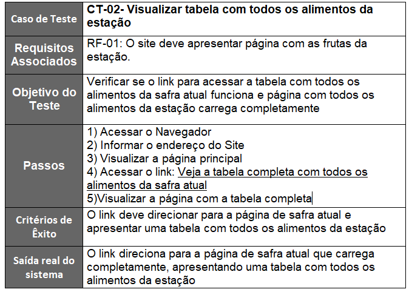
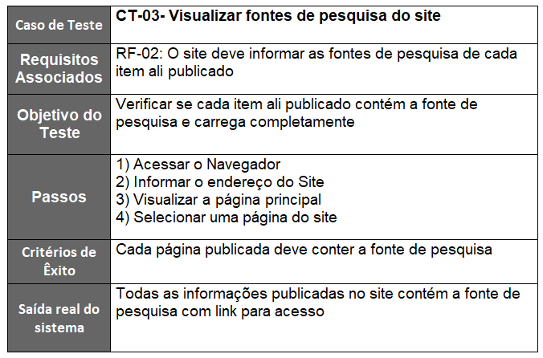
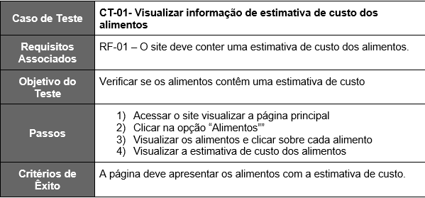
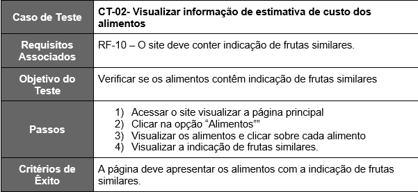

# Plano de Testes de Software

Os requisitos para realização dos testes de software são:  
●	Site publicado na Internet 
●	Navegador da Internet - Chrome, Firefox ou Edge 
●	Conectividade de Internet para acesso às plataformas (APISs) 

Os testes funcionais a serem realizados no aplicativo são descritos a seguir.

## Plano de teste dos requisitos RF-01 e RF-02

## Plano de teste dos requisitos RF-03 e RF-04

## Plano de teste dos requisitos RF-07 e RF-08

**Requisito:** RF-07: O site deve conter informações de manuseio e conservação de alimentos.

**História/Contexto:**

_Eu como_ Maria de Fátima _desejo_ saber como escolher e conservar os melhores alimentos disponíveis no mercado _para_ evitar desperdícios.

_Eu como_ Maria José \*_desejo_ saber como armazenar os alimentos que compro _para_ não estragarem antes de serem usados.

**Caso de teste 1:**

**Objetivo:** Testar a funcionalidade.

**Execução:** Entrar na home. Selecionar alimento em carrossel.

**Saída esperada:** A página de informações nutricionais onde contém informações sobre armazenamento e manuseio de determinado alimento.

**Saída real do sistema:** Página de informações nutricionais onde contém informações sobre armazenamento e manuseio de determinado alimento.

**Caso de teste 2:**

**Objetivo:** Testar a funcionalidade.

**Execução:** Entrar na aba de receitas. Clicar para saber mais informações nutricionais.

**Saída esperada:** A página de informações nutricionais onde contém informações sobre armazenamento e manuseio de determinado alimento.
**Saída real do sistema:** Página de informações nutricionais onde contém informações sobre armazenamento e manuseio de determinado alimento.

**Caso de teste 3:**

**Objetivo:** Testar a funcionalidade.

**Execução:** Entrar na aba de alimentos. Clicar em um dos alimentos apresentados.

**Saída esperada:** A página de informações nutricionais onde contém informações sobre armazenamento e manuseio de determinado alimento.

**Saída real do sistema:** Página de informações nutricionais onde contém informações sobre armazenamento e manuseio de determinado alimento.

**Caso de teste 4:**

**Objetivo:** Testar a funcionalidade.

**Execução:** Selecionar uma receita. Clicar para saber mais informações sobre o alimento principal da receita.

**Saída esperada:** A página de informações nutricionais onde contém informações sobre armazenamento e manuseio de determinado alimento.
**Saída real do sistema:** Página de informações nutricionais onde contém informações sobre armazenamento e manuseio de determinado alimento.

**Requisito:** RF-08: O site deve conter seção de receitas.

**História/Contexto:** _Eu como_ Bruna Santos _desejo_ aprender receitas de qualidade e com baixo custo _para_ economizar sem prejudicar a dieta da família.

_Eu como_ Maria José _desejo_ aprender receitas novas _para_ fazer um cardápio saudável para minha família.

**Caso de teste 1:**

**Objetivo:** Testar a funcionalidade.

**Execução:** Selecionar a aba de receitas. Selecionar uma receita.

**Saída esperada:** Carregar a página com todas receitas disponíveis no site e após seleção de uma receita especifica a amostragem de tal receita.

**Saída real do sistema:** Carregar a página com todas receitas disponíveis no site e após seleção de uma receita especifica a amostragem de tal receita.

**Caso de teste 2:**

**Objetivo:** Testar a funcionalidade.

**Execução:** Selecionar uma receita específica que está disponível na home.

**Saída esperada:** A página da receita selecionada.

**Saída real do sistema:** A página da receita selecionada.

**Caso de teste 3:**

**Objetivo:** Testar a funcionalidade.

**Execução:** Na aba de informações nutricionais de um alimento selecionado clicar em receita.

**Saída esperada:** A página da receita selecionada.

**Saída real do sistema:** A página da receita selecionada.

## Plano de teste dos requisitos RF-09 e RF-10

