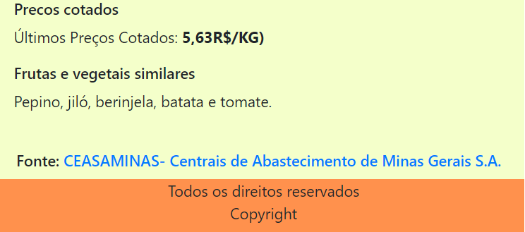

# Registro de Testes de Software
Os resultados obtidos nos testes de software realizados são descritos abaixo. 

## Registro de Testes do RF-01

**CT-01**-Visualizar alimentos da estação 
Conforme apresentado nas imagens abaixo, a página principal carrega completamente, apresentando uma transição com os principais alimentos da safra da estação.  

  

**CT-02**-Visualizar tabela com todos os alimentos da estação 
Conforme apresentado nas imagens abaixo, a página principal apresenta um link para acessar a tabela com todos os alimentos da safra atual. O link direciona para a página de safra atual, que carrega completamente.  

  

  

## Registro de Testes do RF-02

**CT-03**-Visualizar fontes de pesquisa do site 
Conforme apresentado na imagem abaixo,as páginas  apresentam, próximo ao rodapé, a fonte de pesquisa do site com link para acesso.  

  

  

## Registro de Testes do RF-03

**CT-01** Visualizar informações nutricionais.  

Conforme apresentado na imagem abaixo, após clicar na opção ALIMENTOS do menu principal, será recarregada uma página com a lista de alimentos disponíveis.

Após selecionar o alimento desejado, a página de informações nutricionais escolhida será recarregada.

## Registro de Testes do RF-04

**CT-02** Barra de pesquisa.  

Conforme apresentado na imagem abaixo, a barra de pesquisa fornece um filtro de pesquisa com os alimentos cadastrados no site. 

Conforme apresentado na imagem abaixo, após selecionar um alimento no filtro de pesquisar, uma página com as informações nutricionais do alimento escolhido aparece.

## Registro de Testes do RF-09
**CT-01** Visualizar informação de estimativa de custo dos alimentos.  
Conforme apresentado na imagem abaixo, o site apresenta as infoirmações de estimativa de custo dos alimentos

## Registro de Testes do RF-10
**CT-02** Visualizar informação de indicação de frutas similares.  
Conforme apresentado na imagem abaixo, o site apresenta as infoirmações indicação de frutas similares.
